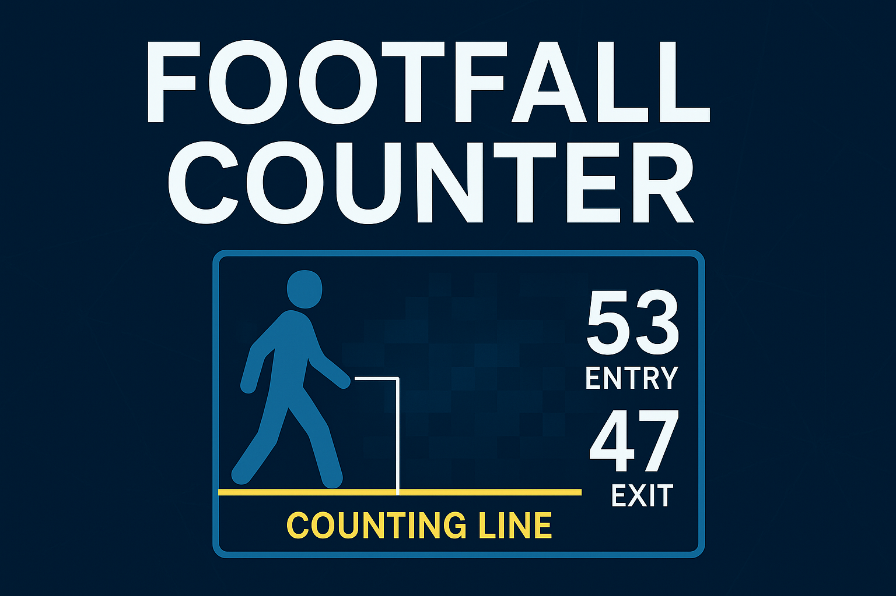

# 🧍‍♂️ Footfall Counter AI

> **AI-Powered People Counting System using YOLOv8 + DeepSORT**

[](https://www.python.org/)
[](https://opencv.org/)
[](https://github.com/ultralytics/ultralytics)
[](LICENSE)
[]()

A high-accuracy **footfall counting system** that uses **YOLOv8** and **DeepSORT** for detecting and tracking people across a defined ROI line.
It automatically classifies movements as **entries** or **exits**, giving precise insights for analytics and crowd monitoring.

---



---

## 🧠 Overview

This system leverages modern AI-based vision techniques for real-time **people tracking and counting** in video footage.
It’s designed for scalability and integration in:

* 🏬 Retail Analytics (shopper insights)
* 🏢 Smart Buildings (occupancy control)
* 🎟️ Events & Venues (capacity tracking)
* 🚇 Public Transport Stations (crowd flow)
* 🧠 Research & Urban Planning

---
## DEMO


---

## ⚙️ Key Features

✅ **Real-Time YOLOv8 Detection**
✅ **DeepSORT Multi-Object Tracking**
✅ **Accurate Entry/Exit Counting**
✅ **Customizable ROI Line**
✅ **Auto-Saving Annotated Videos**
✅ **Quick Run via run.bat**

---

## 🧩 Installation

Clone and install dependencies:

```bash
git clone https://github.com/yourusername/footfall-counter-ai.git
cd footfall-counter-ai
pip install -r requirements.txt
```

Or install manually:

```bash
pip install ultralytics deep-sort-realtime opencv-python numpy
```

---

## ▶️ Quick Start (Windows)

To start instantly, double-click **`run.bat`** in the project folder.

Or run manually:

```bash
python footfall_counter.py
```

By default:

* Model: `yolov8n.pt`
* Input: `test_video.mp4`
* Output: `output_video.mp4`

---

## ⚙️ Custom Usage (Python)

```python
from footfall_counter import FootfallCounter

counter = FootfallCounter(
    model_path='yolov8s.pt',    # Choose any YOLOv8 variant
    roi_line_y=350,             # Adjust counting line position
    confidence_threshold=0.5
)

counter.process_video('mall_video.mp4', 'mall_output.mp4')
```

---

## 📈 Output Example

Each processed frame displays:

* Bounding boxes with **unique IDs**
* **Entry (🟢)** and **Exit (🔴)** counters
* A **counting line** overlay
* **Total movement statistics**

---

## ⚡ Performance Benchmarks

| YOLOv8 Model | Size    | FPS (GPU) | FPS (CPU) | Accuracy | Ideal Use         |
| ------------ | ------- | --------- | --------- | -------- | ----------------- |
| `yolov8n.pt` | Nano    | ~75 FPS   | ~20 FPS   | 89%      | Real-time use     |
| `yolov8s.pt` | Small   | ~60 FPS   | ~15 FPS   | 93%      | General cameras   |
| `yolov8m.pt` | Medium  | ~48 FPS   | ~10 FPS   | 96%      | Busy environments |
| `yolov8l.pt` | Large   | ~40 FPS   | ~8 FPS    | 97%      | High precision    |
| `yolov8x.pt` | X-Large | ~32 FPS   | ~6 FPS    | 98%      | Offline analysis  |

> ⚙️ *Benchmarks tested on RTX 3060 (6GB) + Intel i7 12th Gen.*

---

## 🧰 Project Structure

```
footfall-counter-ai/
│
├── footfall_counter.py        # Core YOLOv8 + DeepSORT logic
├── requirements.txt           # Dependencies
├── run.bat                    # One-click Windows launcher
├── README.md                  # Documentation
├── LICENSE                    # MIT License
└── A_digital_graphic_design_for_a_"Footfall_Counter"_.png  # Banner
```

---

## 🧾 Requirements

* Python 3.8+
* OpenCV 4.x
* Ultralytics YOLOv8
* DeepSORT Realtime
* NumPy

💡 *CUDA GPU acceleration strongly recommended.*

---

## 💡 Future Enhancements

* [ ] Real-time webcam streaming
* [ ] Heatmap generation for density visualization
* [ ] Cloud dashboard integration
* [ ] Multi-zone counting support

---

## 🧑‍💻 Author

**Harsh Bavaskar**
🎓 B.Tech in Computer Science (AI & ML)

---

## 📜 License

This project is licensed under the **MIT License** — see the [LICENSE](LICENSE) file for details.

---

## 🌟 Contributing

Pull requests, bug reports, and feature suggestions are welcome!

1. Fork the repo
2. Create a new branch (`feature/your-feature-name`)
3. Submit a PR 🎉

---

## ❤️ Acknowledgments

* [Ultralytics YOLOv8](https://github.com/ultralytics/ultralytics)
* [DeepSORT Realtime](https://github.com/levan92/deep-sort-realtime)
* [OpenCV](https://opencv.org/)


